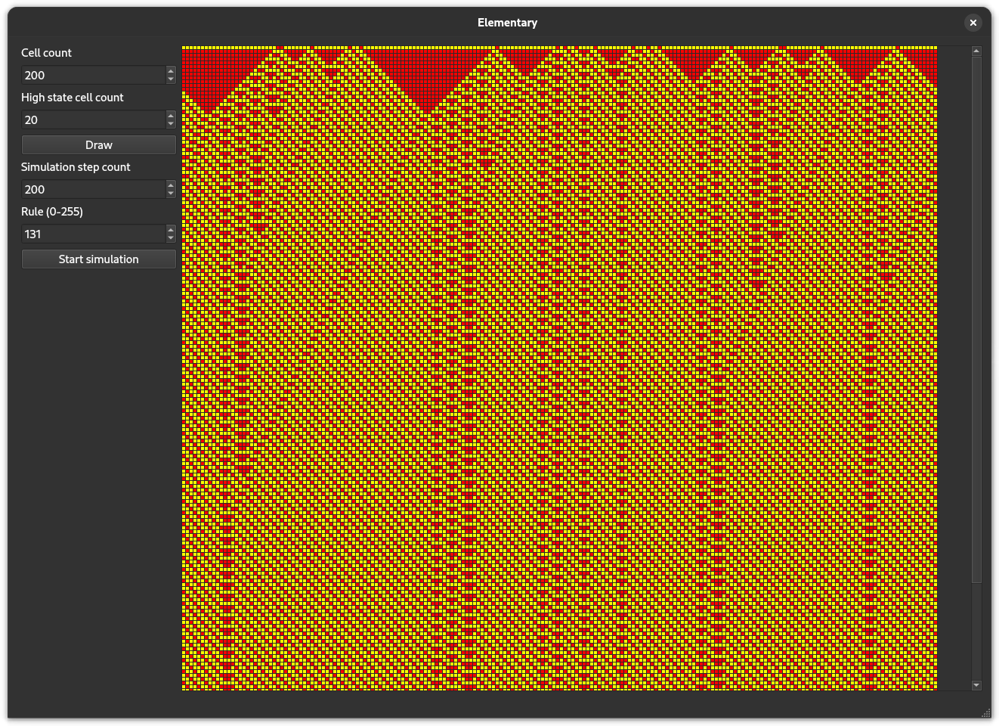
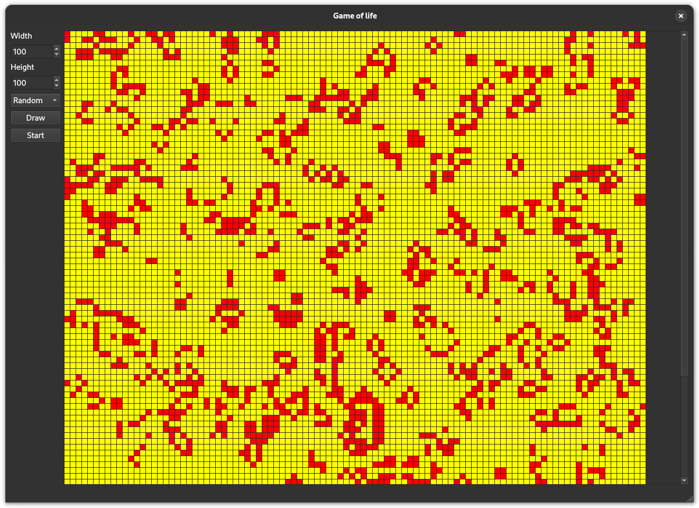
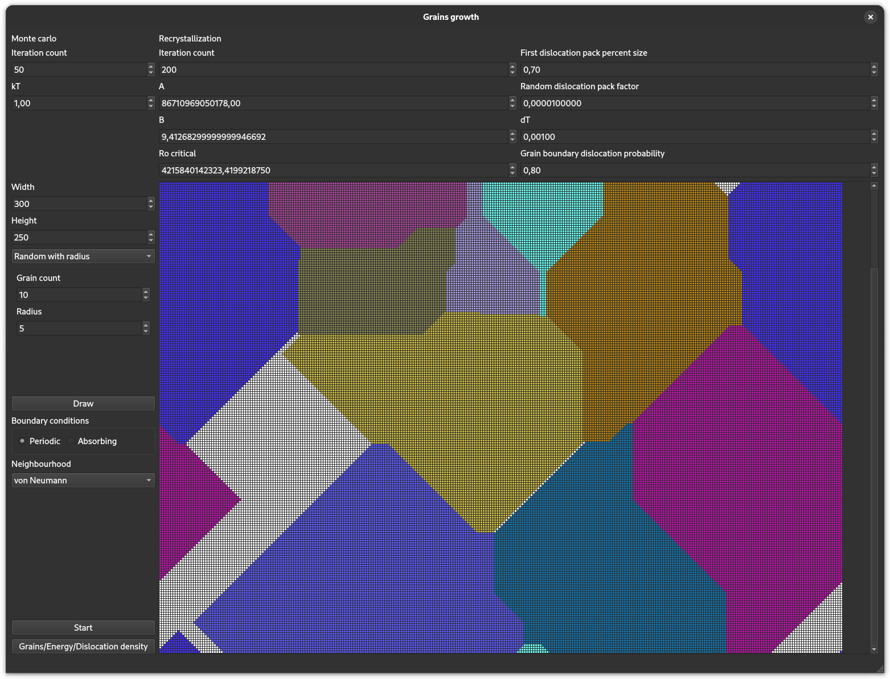
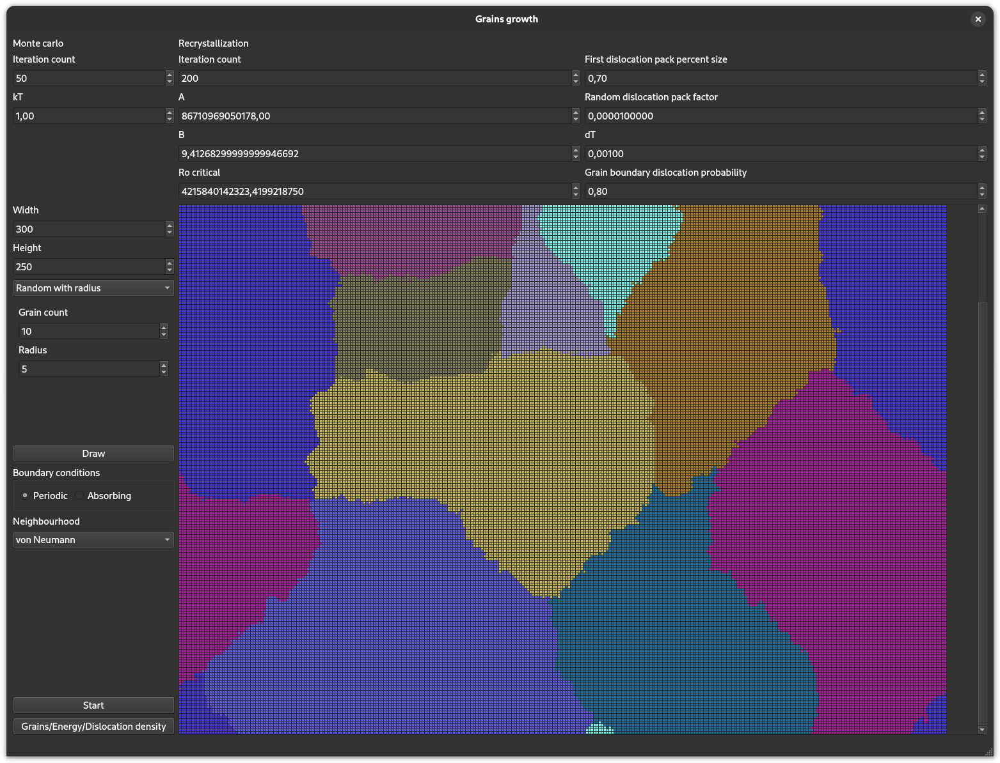
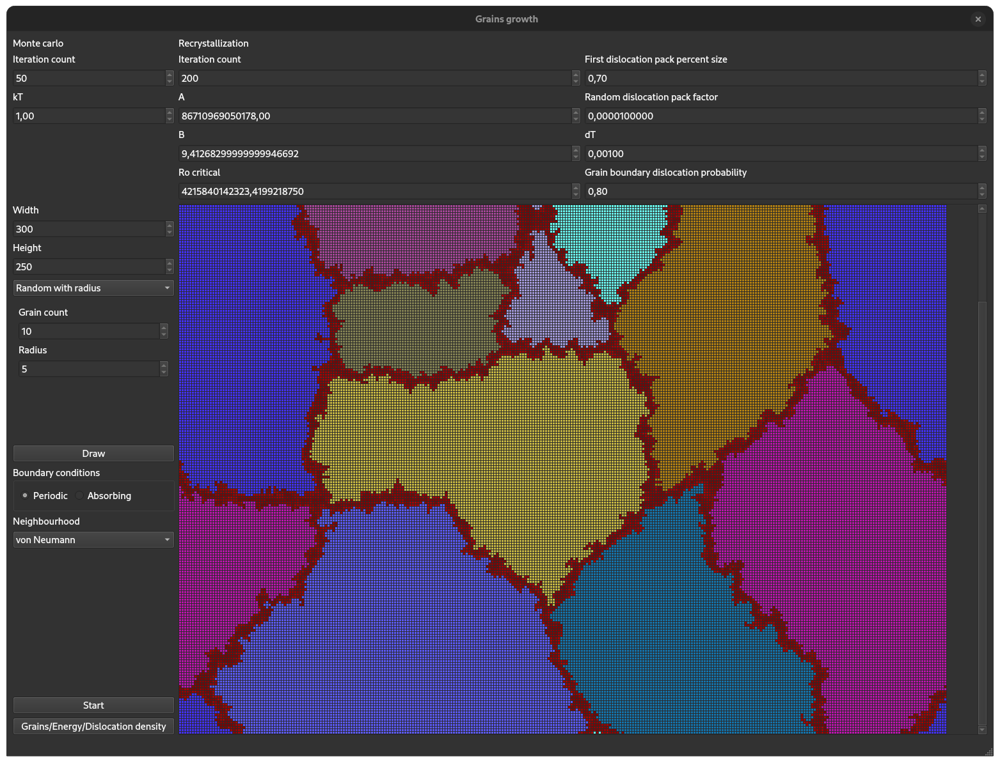
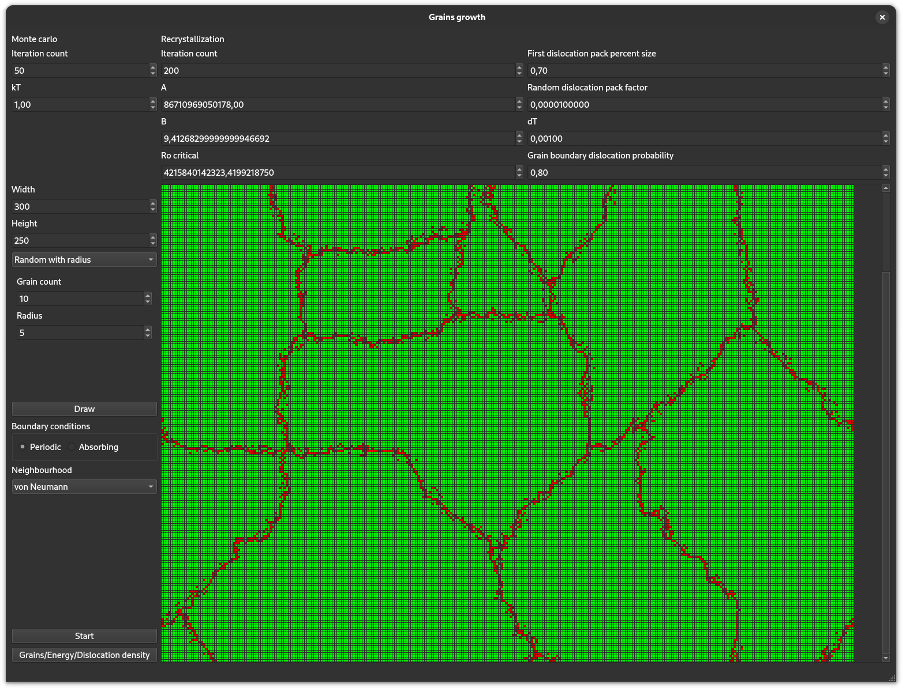
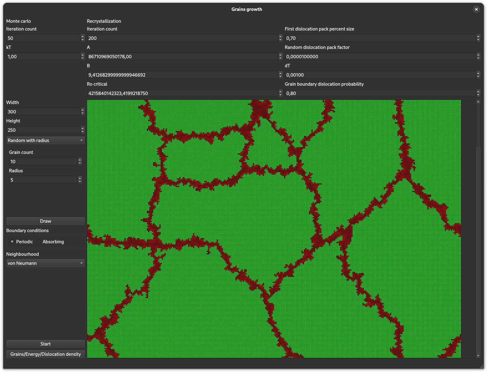

Implementation of various simulations: elementary cellural automaton, Game of Life, and coarse-grain molecural model.

# Prerequisites

- [Boost](https://www.boost.org/)
- [Qt5](https://doc.qt.io/qt-5/)
- [CMake](https://cmake.org/documentation/)

# Installation

When you have all the dependencies installed, clone this repo and run:
```bash
cmake build . -B ./build
cmake --build ./build
```

# Run

```bash
./build/modelling
```

# Simulations

In each simulation, you can choose starting state from selection, and also modify it by clicking cells on a drawn grid.

## Elementary cellural automaton

[Read about elementary cellural automaton](https://en.wikipedia.org/wiki/Elementary_cellular_automaton)



You can play with the inputs, try to find interesting rules!

## Game of life

[Read about game of life](https://en.wikipedia.org/wiki/Conway%27s_Game_of_Life)

Moore neighbourhood and periodic boundary conditions are hardcoded.



## Grains growth

This simulation is divided in 3 phases: grain growth (until whole board is populated), boundary energy growth with monte carlo method and dislocation dynamics with recristalization. I can't even remember what those are or how they're calculated anymore, but it still looks really cool. You can switch views between grains (from the beginning), energy (something is happening from II phase on), and dislocation density (III phase).

Grain growth phase:


Energy growth phase:


Dislocation & recristalization phase:


Energy view in II phase:


Dislocation view in III phase:

